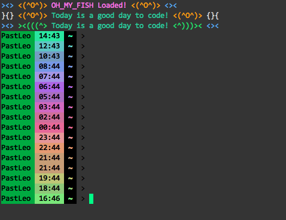

<div align="center">
  <a href="http://github.com/oh-my-fish/oh-my-fish">
  
  </a>
</div>
<br>

> pastfish theme for [Oh My Fish][omf-link].

## Install


```fish
$ omf u pastfish
```

## Features

* Random greeting message
* Command prompts colored based on time (morning is blue, afternoon is green, midnight is red ...)

## Screenshot

<p align="center">

</p>

# License

[MIT][mit] © [chgu82837][author] et [al][contributors]


[mit]:            http://opensource.org/licenses/MIT
[author]:         http://github.com/chgu82837
[contributors]:   https://github.com/chgu82837/pastfish/graphs/contributors
[omf-link]:       https://www.github.com/oh-my-fish/oh-my-fish

[license-badge]:  https://img.shields.io/badge/license-MIT-007EC7.svg?style=flat-square
[travis-badge]:   http://img.shields.io/travis/chgu82837/pastfish.svg?style=flat-square
[travis-link]:    https://travis-ci.org/chgu82837/pastfish
